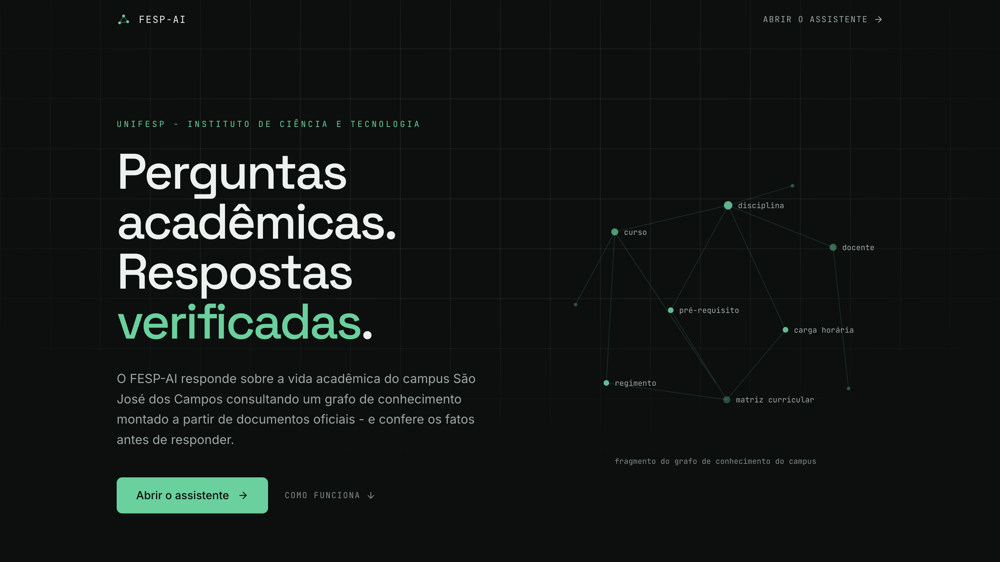
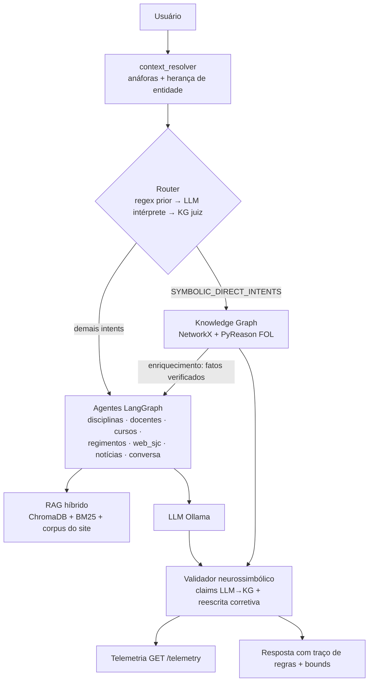

# FESP-AI: Assistente Acadêmico Neurossimbólico da UNIFESP (ICT/SJC)


O **FESP-AI** é um assistente acadêmico **neurossimbólico** para o Instituto de Ciência e Tecnologia da UNIFESP (campus São José dos Campos). Ele combina um **Knowledge Graph** curricular (disciplinas, pré-requisitos, docentes, cursos), **regras de inferência FOL** executadas via **PyReason** e um **LLM** (Ollama), orquestrados por um pipeline **multi-agente em LangGraph**: com RAG híbrido (vetorial + BM25) sobre ementas e regimentos e um corpus vivo do **site institucional do campus**. A tese central: o LLM interpreta e redige, mas **quem julga os fatos é o grafo** - reduzindo alucinação em respostas acadêmicas críticas (pré-requisitos, matrizes curriculares, docentes).

> **Nota:** este repositório acompanha o artigo *Neuro-Symbolic Graph-RAG for Academic Advising: A Three-Cycle Evaluation of a University Web Chatbot* (CTIC — WebMedia 2026). Os números da seção [Avaliação](#avaliação-três-ciclos) correspondem aos reportados no artigo; o material de apoio do Ciclo 2 está em [`docs/usability_report.md`](docs/usability_report.md).



## Arquitetura e Metodologia

Interpretação **LLM-first com grounding simbólico**: regex atua como fast-path/prior barato, o **LLM propõe** (intent, termo, reescrita de follow-ups) e o **KG julga** (grounding de entidades, validação de claims). Intents críticos (`SYMBOLIC_DIRECT_INTENTS` em `src/workflow/router.py`) tomam o **atalho simbólico**: a resposta vem direto do grafo, com **0% de alucinação por construção**.



**Loop bidirecional Neural ↔ Simbólico:**

- **Enriquecimento pré-geração**: fatos verificados do KG são injetados no prompt do agente antes da geração;
- **Validação de claims LLM→KG**: o LLM extrai triplas (código/docente/pré-requisito) da própria resposta e o KG julga cada uma;
- **B1: Reescrita corretiva** - violações disparam corretores dedicados (pré-requisitos, docentes) ou reescrita genérica via LLM ancorada nos fatos do KG;
- **B2: Propagação de incerteza com bounds** - `path_confidence` propaga o menor `confidence` das arestas do caminho e a resposta anota elos parciais ("confiança 70%");
- **B3: Path-finding no DAG de pré-requisitos** - `plan_minimal_path` (BFS topológico) planeja o caminho mínimo até uma disciplina-alvo;
- **B4: Regras FOL explícitas com traço** - respostas simbólicas citam as regras aplicadas (`prereq_transitivity`, `minimal_path`, `unlock_condition`);
- **B5: KGC estrutural + semântico** - completação do grafo combinando similaridade estrutural (0.6) e embeddings semânticos (0.4).

**Outras peças:** fusão multi-fonte **KG ↔ site** com regra de precedência (em divergência, vale o KG e a resposta avisa que a página pode estar desatualizada); **crawler multi-domínio** do site do campus com seccionamento por headings (páginas longas viram uma entrada de corpus por seção h2/h3, com âncora); **telemetria** do loop neurossimbólico (grounding, correções B1, reescritas LLM, claims) em `GET /telemetry`; `kg.lint()` no build do grafo (duplicatas, ciclos no DAG, pré-requisitos pendurados).

## Avaliação (três ciclos)

O sistema foi avaliado em três ciclos iterativos — interface, interação e camada de raciocínio — cada um alimentando correções na camada examinada.

**Ciclo 1 — Acessibilidade (WCAG 2.1).** Conformidade avaliada com o AMAWeb (validador institucional da UNIFESP): landing page 9,8/10 e chat 9,0/10 na primeira rodada; os cinco erros apontados (contraste do texto secundário, h1 e skip link ausentes no chat) foram corrigidos e o re-teste não reportou erros.

**Ciclo 2 — Usabilidade (n = 10, formativo).** Dez estudantes de sete cursos do ICT executaram seis fluxos de tarefa com **100% de sucesso não assistido**; SUS médio **90,0** (mediana 90,0, DP 2,0). Resultados consolidados, matriz SUS por participante e codificação temática das entrevistas em [`docs/usability_report.md`](docs/usability_report.md); instrumento de sessão em [`docs/teste_usabilidade.md`](docs/teste_usabilidade.md).

**Ciclo 3 — Consistência de respostas.** Benchmark de 57 perguntas curadas (8 categorias temáticas, gabarito de documentos oficiais) + 25 queries dirigidas às regras FOL, sobre um KG de 690 nós e 1584 arestas construído de 236 arquivos institucionais. Baselines progressivos com o mesmo corpus e modelo de geração:

| Sistema | Acc estrita | Acc ponderada | Erro |
|---|---|---|---|
| B1 — LLM-only | 7,0% | 19,3% | 68,4% |
| B2 — RAG padrão | 7,0% | 28,1% | 50,9% |
| B3 — Graph-RAG | 57,9% | 60,5% | 36,8% |
| **B4 — NS Graph-RAG (este sistema)** | **84,2%** | **87,7%** | **8,8%** |

Nas 25 queries neurossimbólicas: routing **100%**, verificação simbólica **96%**, com o caminho simbólico respondendo em 1,56 s contra 4,76 s dos caminhos neurais. Anotação humana dupla (κ ≈ 0,54) com cross-check por LLM-as-judge (> 4,7/5 nas quatro dimensões). O benchmark usou `ministral-3:8b`; o sistema em produção roda `gemma4`, que preserva a ordenação dos baselines.

Reprodução (backend de pé em `localhost:8000`): `eval/eval_baselines.py` (B1–B3), `eval/eval_neurosymbolic.py --judge` (B4, routing e verificação), `eval/eval_llm_judge.py` (cross-check).

## Stack

Python 3.11 · FastAPI · LangGraph/LangChain · Ollama (**gemma4** geração + **embeddinggemma** embeddings) · ChromaDB (+ BM25) · NetworkX · PyReason · Next.js (frontend).

## Como rodar

```bash
cp .env.example .env        # escolha MODEL_NAME / EMBEDDING_MODEL
docker compose up -d        # backend :8000 + frontend :3000
```

Requer Ollama acessível (local ou cloud: veja `OLLAMA_CLOUD.md`) com os modelos baixados (`ollama pull gemma4:31b-cloud` e `ollama pull embeddinggemma`).

**Endpoints principais** (`http://localhost:8000`, docs interativas em `/docs`):

| Endpoint | Descrição |
|---|---|
| `POST /chat` | Conversa com o pipeline completo (histórico por `conversation_id`) |
| `POST /crawl-sjc` | (Re)gera o corpus do site institucional do campus |
| `GET /telemetry` | Contadores do loop neurossimbólico |
| `GET /health` | Health check |
| `GET /graph-viewer` · `GET /planner` | Visualizador do KG e planner de grade |

**Testes de regressão** (offline, sem LLM/backend):

```bash
python3 test_routing.py               # roteamento (31 casos)
python3 test_site_crawler.py          # crawler/seccionamento (20 casos)
python3 test_neurosym_b1_b2.py        # B1 reescrita corretiva / B2 bounds
python3 test_conversation_history.py  # histórico multi-turno nos prompts
python3 test_graph_term_extraction.py # grounding de termos no KG
python3 test_neurosymbolic.py         # validador neurossimbólico
python3 test_planner.py               # planner de grade (BFS topológico)
python3 test_pyreason_bounds.py       # propagação de bounds via PyReason
python3 test_pyreason_parity.py       # paridade PyReason × referência Python
```

**Evals** (requerem o backend de pé em `localhost:8000`):

```bash
python3 eval/eval_neurosymbolic.py --judge   # routing + verificação simbólica + LLM-judge
python3 eval/eval_site_conversations.py      # 10 conversas multi-turno (exit code ≠ 0 em falha)
python3 eval/eval_baselines.py               # baselines: LLM-only, RAG padrão, GraphRAG
```

## Estrutura do repositório

```
├── src/
│   ├── api.py                     # FastAPI (endpoints acima)
│   ├── multi_agent_rag.py         # orquestração multi-agente
│   ├── workflow/                  # router (SYMBOLIC_DIRECT_INTENTS), pipeline LangGraph, estado
│   ├── agents/                    # disciplinas, docentes, cursos, regimentos, web_sjc, notícias...
│   ├── knowledge_graph.py         # KG (NetworkX) + lint
│   ├── pyreason_engine.py         # regras FOL via PyReason (bounds)
│   ├── neurosymbolic_validator.py # claims LLM→KG + reescrita corretiva (B1)
│   ├── graph_rag.py               # GraphRAG + grounding de termos no KG
│   ├── site_crawler.py            # crawler do site do campus (seções por heading)
│   ├── context_resolver.py        # anáforas e herança de contexto entre turnos
│   └── telemetry.py               # contadores do loop neurossimbólico
├── frontend/                      # chat Next.js
├── eval/                          # scripts de avaliação (baselines B1–B4, judge, benchmark)
├── docs/                          # relatório de usabilidade + instrumento de sessão
├── markdown_*/                    # dados curriculares (fonte do KG e do RAG)
├── test_*.py                      # testes de regressão offline
└── BACKLOG.md                     # histórico de features e backlog
```
